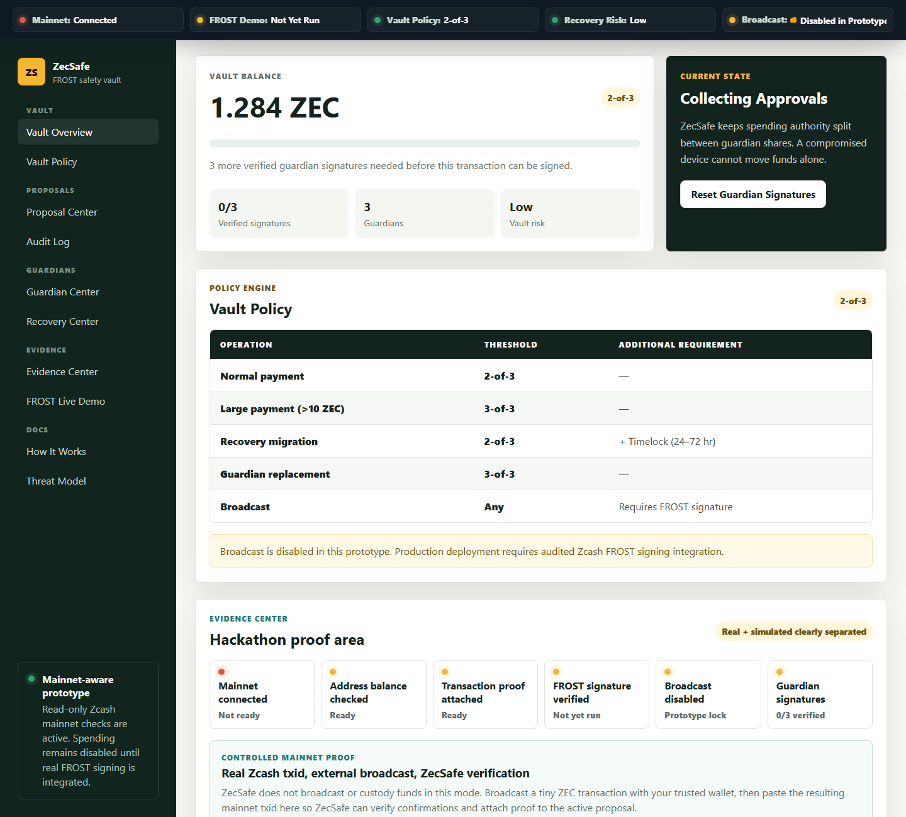
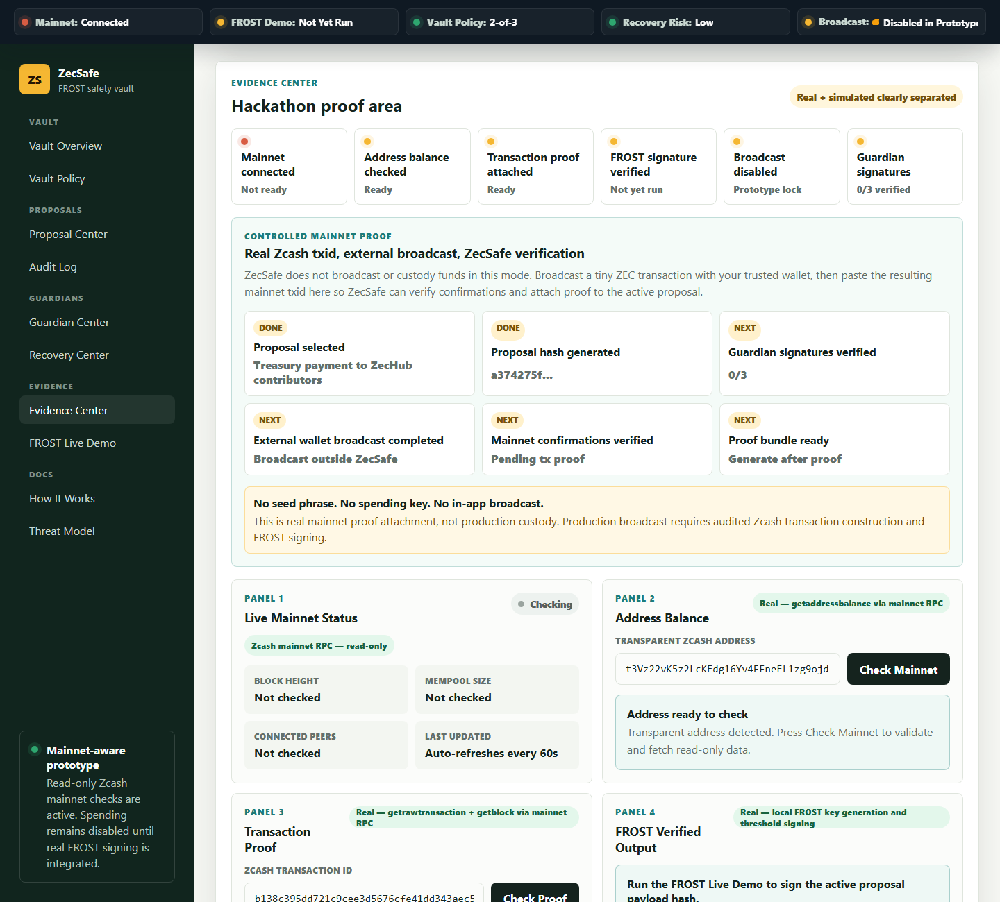
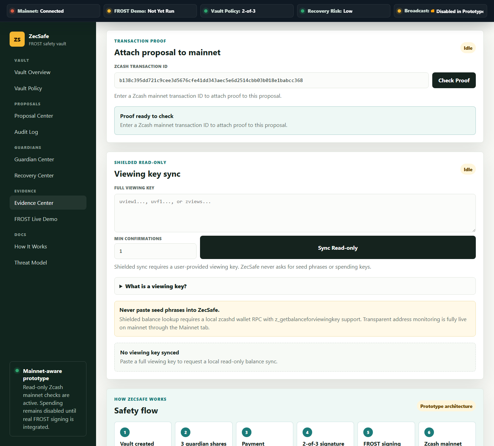
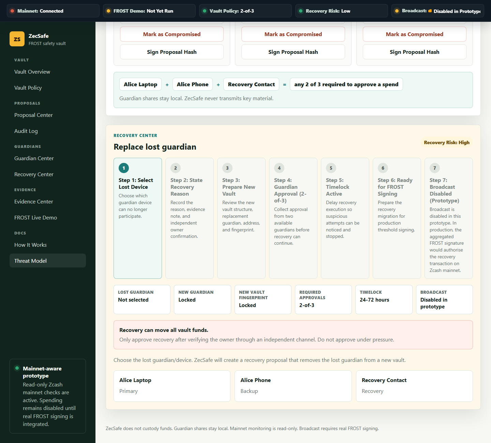

# ZecSafe

ZecSafe is a Zcash mainnet safety vault proof-of-concept for reducing single-key failure in self-custody and small-team treasury workflows.

The project combines live Zcash mainnet evidence, guardian cryptographic acknowledgements, controlled mainnet transaction proof attachment, recovery protection, vault policy rules, and local threshold-signing proof in one security workflow.

## Problem

Self-custody gives users control, but one seed phrase or one device can become a hard failure point. If it is stolen, funds can be drained. If it is lost, access can disappear. Teams face the same problem when one person controls treasury funds alone.

## Solution

ZecSafe explores a threshold safety vault:

- Split authority across multiple guardians.
- Require 2-of-3 approval before a spend can proceed.
- Show transaction details and risk checks before approval.
- Link proposals to read-only Zcash mainnet evidence.
- Prepare a production path for Zcash FROST signing.

## Features

- Persistent Security Command Center showing mainnet, FROST, vault policy, recovery risk, and broadcast state.
- Secure Transfer Room for running the full proof flow from one place: create proposal, review locked details, sign guardians, verify tx proof, run FROST proof, and export evidence.
- Vault Overview with 2-of-3 threshold state and a clear Zcash FROST safety-vault identity.
- Vault Policy table for normal payments, large payments, recovery migration, guardian replacement, and broadcast requirements.
- Proposal Center with transaction queue, filters, risk badges, guardian approval timeline, and mainnet-evidence attachment.
- Practical proposal creation flow for entering a real amount, recipient, memo, expected fee, and optional externally broadcast txid.
- Security Review Gate that shows the generated proposal hash, locked recipient, amount, fee, memo, risk level, and threshold before the proposal enters the queue.
- Proposal payload integrity with canonical payload hash, recipient fingerprint, locked amount, locked memo, and FROST signing requirement.
- Browser-side guardian signature proofs where each guardian signs the stable proposal payload hash before readiness is reached.
- Guardian Center with exactly three guardians, role badges, health checks, lost/compromised states, and a visual 2-of-3 model.
- Evidence Center combining live mainnet status, transparent address balance, transaction proof, proposal-bound FROST output, downloadable proof bundle generation, and a real-vs-simulated table.
- Mainnet Proof Run page with a readiness score for the final demo: proposal hash, guardian signatures, mainnet status, address balance, txid, confirmations, local FROST proof, and proof bundle.
- Controlled Mainnet Proof mode for linking an externally broadcast Zcash mainnet txid to the active proposal.
- Read-only transparent address monitor using Zcash mainnet RPC.
- Transaction proof lookup using a real Zcash transaction ID.
- Local viewing-key balance route for future shielded/unified sync.
- Recovery Center with a 7-step guided flow, recovery reason, independent confirmation, new-vault fingerprint, timelock, and suspicious-flag action.
- Visible audit log for proposal, guardian, mainnet, FROST, and recovery events.
- In-app safety flow diagram, threat model, and demo guide.
- Local FROST demo through `scripts/frost-demo.mjs`, `scripts/frost-local-wrapper.mjs`, and `/api/frost-demo`.
- Judge Mode walkthrough for the strongest demo path.

## Real vs Simulated

| Component | Status | Notes |
|---|---|---|
| Mainnet RPC reads | Real | Read-only calls through the ZecSafe backend adapter |
| Transparent address balance | Real | Uses `getaddressbalance` |
| Transaction proof lookup | Real | Uses local `getrawtransaction`/`getblock` first, then public explorer fallback while the local node syncs |
| Controlled mainnet proof attachment | Real | Links an externally broadcast mainnet txid to a ZecSafe proposal |
| FROST local demo | Real when local tools are installed | Signs the active proposal payload hash using `trusted-dealer`, `participant`, and `coordinator` from `frost-zcash-demo` through `scripts/frost-local-wrapper.mjs` |
| Guardian approval acknowledgement | Real local browser crypto | Guardians sign the stable proposal payload hash with browser-generated ECDSA keys |
| Proof bundle | Real + summary | Combines mainnet status, address balance, transaction proof, FROST result, guardian signatures, timestamp, and real-vs-simulated status |
| Vault policy engine | Prototype app logic | Shows threshold policy and broadcast requirements |
| Transaction broadcast | External/manual in current build | ZecSafe verifies the txid but does not broadcast or custody funds |
| Recovery migration | Simulated | No real fund movement |
| Viewing-key balance | Requires local zcashd | Graceful fallback message shown when not configured |

## Interface Overview

The app is organized into five navigation groups:

- **VAULT:** Vault Overview and Vault Policy.
- **PROPOSALS:** Proposal Center and Audit Log.
- **GUARDIANS:** Guardian Center and Recovery Center.
- **EVIDENCE:** Mainnet Proof Run, Evidence Center, and FROST Live Demo.
- **DOCS:** How It Works, Threat Model, and Demo Guide.

The top Security Command Center stays visible across the app. It shows whether mainnet is connected, whether the FROST demo has verified a signature this session, the vault policy, recovery risk, and the prototype broadcast lock.

The **Secure Transfer Room** is the action path for demos. It shows the current proposal, amount, guardian signature count, mainnet proof state, and next best action. Its three primary actions create a secure proposal, verify a mainnet transaction, or start protected recovery.

The interface now behaves like a focused product app instead of a long one-page document. The home view shows only the command mission, live mainnet status, and vault summary. Selecting Proposal Center, Evidence Center, Guardian Center, Recovery Center, FROST Live Demo, or Docs opens that focused workspace as its own page.

## Judge Demo Path

For judging, the strongest path is:

1. Open **Mainnet Proof Run** and show the readiness score.
2. Click **Create Secure Proposal** if no final proposal exists yet.
3. Enter the amount, recipient, fee, memo, and optional external txid.
4. Show the **Security Review Gate** with the proposal hash and locked details.
5. Create the proposal and sign the proposal hash with guardians.
6. Broadcast a tiny ZEC transaction externally with a trusted wallet.
7. Paste the real mainnet txid into **Mainnet Proof Run**.
8. Verify confirmations and attach the txid to the active proposal.
9. Run **FROST Live Demo** and show `Signature Verified` plus the proposal payload hash.
10. Generate the **Proof Bundle** and show the judge-readable ZecSafe proof receipt.

## Final Mainnet Proof Run

The **Mainnet Proof Run** page is the final submission checklist. It shows whether the demo is ready across nine proof requirements:

1. Proposal created and selected.
2. Proposal hash locked.
3. Guardian signatures verified.
4. Live Zcash mainnet status checked.
5. Transparent address balance checked.
6. Tiny ZEC txid attached.
7. Confirmation proof verified.
8. Local FROST proof verified.
9. Downloadable proof bundle ready.

The page intentionally keeps broadcast outside ZecSafe. The operator should use a trusted wallet and a very small amount of ZEC, then paste the resulting txid into ZecSafe for read-only verification and proof-bundle export.

## Practical Proposal Workflow

ZecSafe can now raise a proposal from operator-provided transaction details:

1. Open **Proposal Center**.
2. Click **Create Secure Proposal**.
3. Enter the proposal title, amount, expected fee, recipient address, memo/reason, and optional txid from an external wallet broadcast.
4. ZecSafe validates transparent mainnet addresses locally and accepts unified/shielded recipients as private recipients.
5. ZecSafe opens a **Security Review Gate** before the proposal is created.
6. The operator reviews the proposal hash, amount, recipient fingerprint, memo, fee, txid, risk level, and threshold requirement.
7. ZecSafe creates a canonical proposal payload hash that locks amount, recipient, memo, fee, txid, network, and vault threshold.
8. Guardians sign that payload hash using local browser cryptographic acknowledgements.
9. The operator checks the txid in **Transaction Proof**.
10. ZecSafe attaches confirmations and exports the proposal evidence in the proof bundle.

This makes the working product boundary explicit: ZecSafe creates, signs, verifies, and documents the safety workflow around a real mainnet transaction, while broadcast remains external until audited Zcash FROST transaction signing is integrated.

This path keeps the demo focused on what is strongest: real read-only mainnet evidence, real local threshold-signing proof, and honest prototype boundaries.

## Screenshots









## How It Uses Zcash Mainnet

Current mainnet interactions:

- Calls `getblockchaininfo` to display live Zcash mainnet chain status.
- Calls `getblockcount` to display current block height.
- Calls `getmempoolinfo` to show live mempool size.
- Calls `getpeerinfo` to count connected peers.
- Validates transparent Zcash mainnet addresses locally.
- Calls `getaddressbalance` through the ZecSafe backend adapter for public transparent address monitoring.
- Calls `getrawtransaction` through the ZecSafe backend adapter for transaction proof lookup.
- Calls `getblock` for transaction proof block height and confirmation context.
- Provides a local `/api/viewing-key-balance` route that can call `z_getbalanceforviewingkey` when connected to a local `zcashd` RPC endpoint.

ZecSafe does not broadcast real Zcash transactions yet. For controlled mainnet proof, users broadcast a tiny transaction externally with a trusted wallet, paste the txid into ZecSafe, verify confirmations, and attach that evidence to the proposal.

## Controlled Mainnet Proof Workflow

For the mainnet demo, ZecSafe proves the transaction lifecycle without taking custody:

1. Create or select a proposal.
2. Generate the stable proposal payload hash.
3. Sign the proposal hash with enough guardians.
4. Broadcast a tiny ZEC transaction externally using a trusted wallet or tool.
5. Paste the resulting Zcash mainnet txid into ZecSafe.
6. Verify confirmations through the mainnet proof lookup.
7. Attach the txid to the active proposal.
8. Export the proof bundle JSON.

ZecSafe never asks for seed phrases, private spending keys, or wallet passwords.

## Setup

Use Node.js 18 or newer.

```powershell
node server.mjs
```

Then open:

```text
http://127.0.0.1:4173
```

No package install or build step is required.

In this Codex workspace, the bundled Node runtime can be used:

```powershell
C:\Users\DELL\.cache\codex-runtimes\codex-primary-runtime\dependencies\node\bin\node.exe server.mjs
```

## Optional Zcash RPC Setup

ZecSafe can run against a local Zcash mainnet node. On this Windows machine, the working setup is:

- WSL distro: `Ubuntu-24.04`
- Zcash node: `zcashd` v6.12.2
- RPC URL: `http://127.0.0.1:8232`
- RPC user: `zecsafe`
- RPC password file inside WSL: `/root/.zcash/zecsafe-rpc-password.txt`

Start ZecSafe with the local node adapter:

```powershell
powershell -ExecutionPolicy Bypass -File scripts\start-zecsafe-local-rpc.ps1
```

Manual environment setup is also supported:

```powershell
$env:ZEC_RPC_URL="http://127.0.0.1:8232/"
$env:ZEC_RPC_USER="your-rpc-user"
$env:ZEC_RPC_PASSWORD="your-rpc-password"
node server.mjs
```

The local `zcashd` config must enable read-only explorer-style calls used by the app:

```text
mainnet=1
server=1
txindex=1
experimentalfeatures=1
insightexplorer=1
```

The node must finish syncing before balance and transaction proof results are final. During initial sync, ZecSafe may show a live local RPC connection with an early block height.

For transaction proof, ZecSafe uses local `zcashd` first. If the local node is still syncing and cannot find a later transaction yet, ZecSafe falls back to the read-only Blockchair Zcash API to fetch transaction height, output totals, fee, and confirmation count. The UI labels this as `blockchair-public-explorer-api` so judges can see the proof source.

The route is:

```text
POST /api/viewing-key-balance
```

It accepts full viewing keys such as `uview1`, `uvf1`, or `zviews...`. Never paste seed phrases or spending keys.

When local `zcashd` is not configured, this route returns a structured `public-rpc-unavailable` response instead of failing with a server error. This is intentional because shielded viewing-key balances require wallet-aware infrastructure.

## FROST Library

ZecSafe is designed for the official Zcash Foundation FROST tooling:

- Repository: [ZcashFoundation/frost-tools](https://github.com/ZcashFoundation/frost-tools)
- Demo CLI source: [ZcashFoundation/frost-zcash-demo](https://github.com/ZcashFoundation/frost-zcash-demo)
- Local adapter script: `scripts/frost-demo.mjs`
- Local wrapper script: `scripts/frost-local-wrapper.mjs`
- Backend route: `GET /api/frost-demo`

The default wrapper runs the installed `trusted-dealer`, `participant`, and `coordinator` demo binaries. It generates a fresh 2-of-3 FROST group, produces two participant commitments, creates two partial signatures, aggregates the final signature, and returns judge-friendly JSON to the UI.

When run from the app, the FROST route receives the active proposal's canonical payload hash and signs the message:

```text
ZecSafe proposal payload hash: <sha256>
```

This does not yet sign a Zcash spend transaction, but it proves the local threshold-signing output is bound to the exact proposal data shown in the UI.

You can override the built-in wrapper with:

```powershell
$env:FROST_DEMO_COMMAND="your-local-frost-demo-command"
```

That command should return JSON containing a group public key, key-share fingerprints, signing commitments, partial signatures, an aggregated signature, and a `verified` boolean. If the official tools are missing, ZecSafe shows an honest prerequisite checklist and does not fake cryptographic signing.

Windows setup notes are in [docs/frost-windows-setup.md](docs/frost-windows-setup.md).

## Usage

1. Open the dashboard.
2. Review the Security Command Center and Vault Overview.
3. Open Vault Policy to see the action thresholds.
4. Open Evidence Center and check the sample transparent Zcash address.
5. Attach the sample transaction proof to the active proposal.
6. Run the FROST Live Demo to generate local threshold-signing proof when tooling is available.
7. Open Proposal Center, review the proposal queue, risk level, recipient, memo, guardian timeline, and mainnet evidence badge.
8. Sign with guardians and confirm the proposal moves toward FROST readiness only after verified local signatures.
9. Open Guardian Center, run a guardian health check, and review the 2-of-3 model.
10. Start Recovery Center, select a lost guardian, enter a recovery reason, verify out-of-band confirmation, create a recovery proposal, and approve with the remaining guardians.
11. Review the Audit Log, Threat Model, and Demo Guide.

## Prototype Limitations

- Guardian approval acknowledgements are real browser-side signatures, but they are not Zcash spend signatures and are not stored on separate guardian devices yet.
- Broadcast is external/manual in the current build; ZecSafe verifies the resulting txid.
- Recovery migration is simulated.
- Recovery includes a shortened prototype timelock; production should use a 24-72 hour delay or stricter policy.
- The app does not custody, sign, or spend real funds.
- Mainnet monitoring is read-only.
- Shielded/unified balance sync needs local zcashd or wallet-scanning infrastructure.
- The FROST section demonstrates local threshold cryptography, but it does not yet sign or broadcast a real Zcash transaction.

## Production Boundary

ZecSafe intentionally does not overclaim production custody. The current prototype does not yet include:

- Real Zcash transaction construction and signing.
- Guardian devices producing cryptographic signatures from distributed shares.
- FROST signatures bound to a real Zcash spend transaction payload.
- Live shielded wallet scanning without local wallet infrastructure.

Those items are the next production layer after the hackathon proof-of-concept.

## Threat Model

Intended production protections:

- A stolen single device is not enough to spend.
- A lost single device does not permanently destroy access.
- Team funds are not controlled by one person alone.
- Payments are reviewed before signing.
- Recovery migration requires stricter checks because it can move all vault funds.

Current non-goals:

- This prototype does not secure real funds.
- It does not make transparent address activity private.
- It does not replace reviewed wallet software.
- It demonstrates local FROST threshold signing output, but does not yet connect those signatures to a real Zcash spend transaction.
- It does not perform live recovery migration.

## Documentation

- [Architecture](docs/architecture.md)
- [Architecture diagram](docs/architecture-diagram.md)
- [Mainnet integration](docs/mainnet-integration.md)
- [FROST integration](docs/frost-integration.md)
- [FROST Windows setup](docs/frost-windows-setup.md)
- [Threat model](docs/threat-model.md)
- [Roadmap](docs/roadmap.md)
- [Submission plan](docs/submission-plan.md)
- [Demo script](docs/demo-script.md)
- [Operator notepad](docs/operator-notepad.md)
- [Pull request checklist](docs/pr-checklist.md)

## Verification

```powershell
node scripts/verify.mjs
```

Expected output:

```text
ZecSafe static verification passed.
```

To refresh README screenshots after UI changes:

```powershell
node scripts/capture-screenshots.mjs
```

## Submission Checklist

- [ ] PR submitted to ZecHub repo
- [ ] Video demo shared in `#zechub` Discord
- [ ] `SUBMISSION.md` included
- [ ] All screenshots present in `docs/screenshots/`
- [ ] `verify.mjs` passes
- [ ] License file present

## License

MIT. See [LICENSE](LICENSE).
