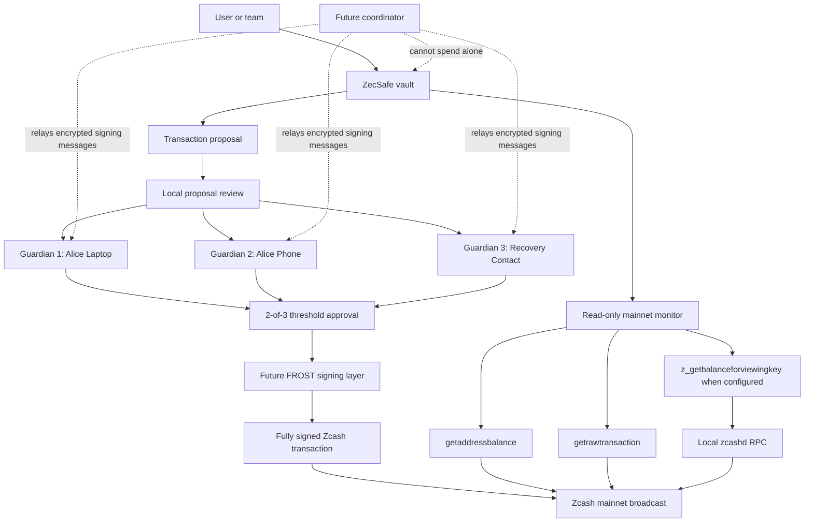

# Architecture Diagram

## Production Notes

- Guardian devices should review transaction details locally before signing.
- The coordinator should relay messages but never hold enough material to spend.
- Viewing-key sync must stay read-only and should be encrypted or local-first.
- Real fund safety depends on audited Zcash wallet and FROST signing libraries.
