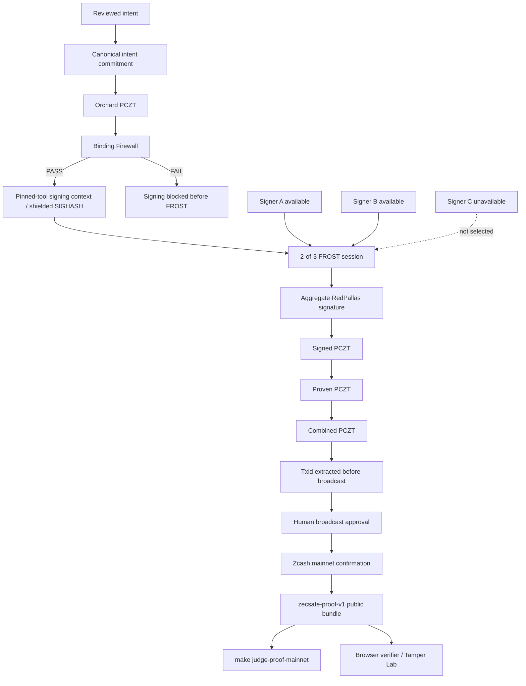

# Architecture Diagram

## Notes

- The hosted app replays a recorded mainnet proof; it is not a live wallet.
- The public proof excludes private transaction details, wallet material, signing shares,
  randomizers, UFVK material, and private PCZT internals.
- Zcash consensus validates the spend normally. It does not expose a special FROST marker.
- FROST provenance is evidenced by the recorded ZecSafe/FROST session and artifact
  fingerprints.
